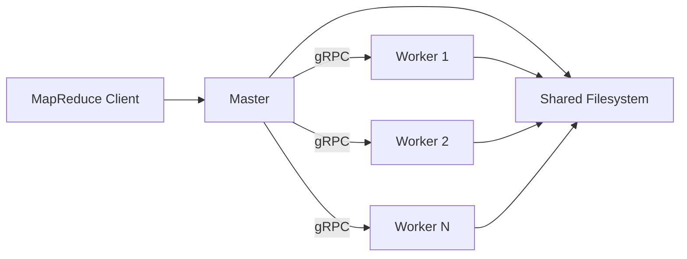

# MapReduce Framework using Java and gRPC

A Java MapReduce framework that distributes map and reduce tasks across standalone gRPC worker processes.

The client reads a job configuration, partitions input files into shards, coordinates workers through an in-process master, and writes reducer results to partitioned output files.

## Architecture



- **Client** reads `config.properties` and starts the MapReduce job.
- **Master** shards input files, schedules tasks, handles worker failures, and coordinates map and reduce phases.
- **Workers** run as standalone gRPC servers and execute registered mapper and reducer implementations.
- **Task registry** maps an `app_id` to a built-in `TaskFactory`.
- **Shared filesystem** stores input, intermediate, and final output files.

The client and master run in the same JVM. Each worker runs in a separate JVM.

## Requirements

- Java 25
- Git
- A Unix-like shell
- No separate Gradle installation is required; the Gradle wrapper is included.

## Build

From the project directory, run the tests:

```bash
./gradlew test
```

Create the command-line distribution:

```bash
./gradlew clean installDist
```

The generated scripts are located in:

```text
build/install/MapReduceFramework/bin/
```

Available scripts:

```text
worker-main
map-reduce-main
```

## Word Count Example

### 1. Prepare Input

Create one or more non-empty text files:

```text
input/
├── document-1.txt
└── document-2.txt
```

Example input:

```text
hello world
hello mapreduce
```

### 2. Create the Output Directory

```bash
mkdir -p output
```

The output directory must exist before the job starts. Existing `intermediate/` and `final/` contents are deleted when a new job begins.

### 3. Create `config.properties`

```properties
num_workers=2
worker_addresses=localhost:50051,localhost:50052
input_files=input/document-1.txt,input/document-2.txt
output_dir=output
num_output_files=4
map_kilobytes=500
app_id=wordcount
```

### Configuration Reference

| Property | Description |
|---|---|
| `num_workers` | Number of worker processes used by the job |
| `worker_addresses` | Comma-separated worker addresses in `host:port` format |
| `input_files` | Comma-separated input file paths |
| `output_dir` | Existing directory for intermediate and final output |
| `num_output_files` | Number of reducer partitions and final output files |
| `map_kilobytes` | Target input shard size in kilobytes |
| `app_id` | Registered MapReduce application identifier |

`num_workers` must equal the number of entries in `worker_addresses`.

Relative file paths are resolved from the working directory where the client is launched. The client and all workers must be able to access the same filesystem paths.

### 4. Start the Workers

Open one terminal for each worker.

Worker 1:

```bash
build/install/MapReduceFramework/bin/worker-main \
  localhost:50051
```

Worker 2:

```bash
build/install/MapReduceFramework/bin/worker-main \
  localhost:50052
```

Wait until each worker reports that its gRPC server is listening.

### 5. Run the Client

In another terminal:

```bash
build/install/MapReduceFramework/bin/map-reduce-main \
  config.properties
```

The process exits with status `0` when the job succeeds and `1` when it fails.

### 6. Inspect the Results

Final reducer output is written to:

```text
output/final/
```

Display all partitions:

```bash
cat output/final/*
```

Example output:

```text
hello 2
mapreduce 1
world 1
```

Output is partitioned. Keys are ordered within each reducer output file, but the combined files are not guaranteed to be globally ordered.

Stop each worker with `Ctrl+C`.

## Running from IntelliJ IDEA

Create separate **Application** run configurations.

### Worker

```text
Main class: com.frg96.mapreduce.worker.WorkerMain
Program arguments: localhost:50051
Working directory: $PROJECT_DIR$
Module classpath: MapReduceFramework.main
JRE: Java 25
```

Duplicate the configuration for each worker and change the port.

### Client

```text
Main class: com.frg96.mapreduce.client.MapReduceMain
Program arguments: $PROJECT_DIR$/config.properties
Working directory: $PROJECT_DIR$
Module classpath: MapReduceFramework.main
JRE: Java 25
```

Start all worker configurations before starting the client.

To generate the command-line distribution from IntelliJ, run:

```text
Gradle → Tasks → distribution → installDist
```

## Adding an Application

MapReduce applications implement `TaskFactory`:

```java
public final class ExampleTaskFactory implements TaskFactory {
    @Override
    public Mapper createMapper() {
        return new ExampleMapper();
    }

    @Override
    public Reducer createReducer() {
        return new ExampleReducer();
    }
}
```

Register the factory in `BuiltInApps`:

```java
public static void registerAll() {
    register("wordcount", new WordCountTaskFactory());
    register("example", new ExampleTaskFactory());
}
```

Select it in `config.properties`:

```properties
app_id=example
```

Every standalone worker maintains its own in-memory task registry. All workers must therefore run the same application build.

After adding or changing an application, rerun:

```bash
./gradlew installDist
```

Restart every worker to load the updated task registry and application classes.

## Project Structure

```text
src/main/java/com/frg96/mapreduce/
├── api/       Public mapper, reducer, context, and job APIs
├── apps/      Built-in MapReduce applications
├── client/    Command-line client entry point
├── core/      Configuration, validation, and file sharding
├── master/    Task scheduling and worker coordination
└── worker/    gRPC worker server and task execution
```

Protocol definitions are located in:

```text
src/main/proto/mapreduce.proto
```

## Testing

Run the complete test suite:

```bash
./gradlew test
```

The generated HTML report is located at:

```text
build/reports/tests/test/index.html
```

The test suite includes unit tests for core components and integration tests for the word-count application.

## Current Limitations

- Workers and the client must have access to the same input and output filesystem paths.
- Mapper and reducer implementations must be installed in every worker JVM.
- The task registry is built locally in each worker and is not shared across JVMs.
- The client and master run in the same process.
- Transport uses insecure gRPC credentials.
- A job consists of one map phase followed by one reduce phase.
- Input records are processed one line at a time.
- Final output is partitioned and is not globally sorted across files.